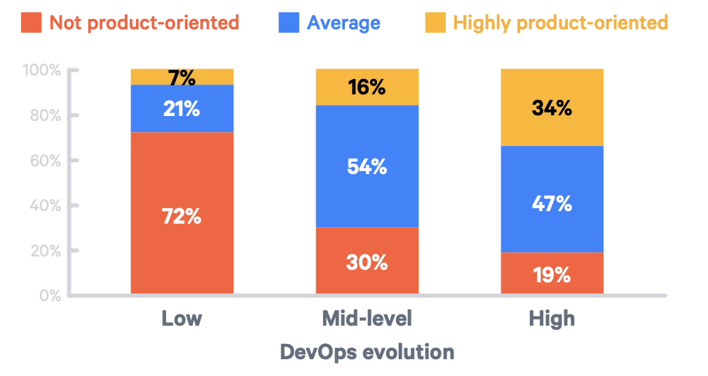
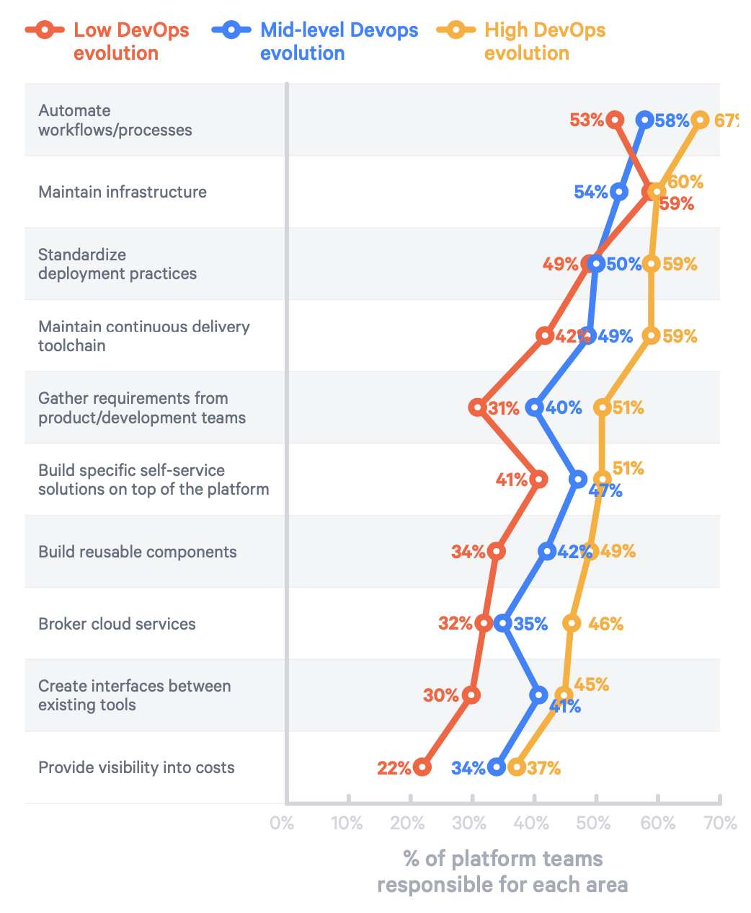

# Internal Developer Platform

!!! note ""

    Reduction of complexity and cognitive load for the end user of the Internal Developer Platform.

#### IDP is a product

<figure markdown>
  { width="500" }
  <figcaption>Platform Team Behaviour</figcaption>
</figure>

#### IDP definition

<figure markdown>
  { width="500" }
  <figcaption>Platform Team Responsibilities</figcaption>
</figure>

- [x] Infrastructure Orchestration
- [x] Application Configuration
- [x] Deployment Management
- [x] Environment Management
- [x] ABAC/RBAC